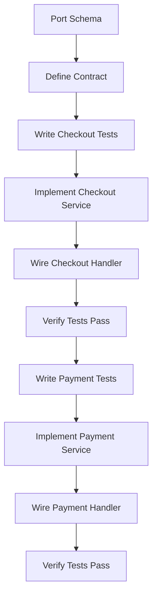

# Migration Plan: Legacy Widget API → Modern API Plugin

This document outlines the test-driven migration strategy for porting the legacy `_legacy/widget-api` codebase to the modern `api/` plugin architecture.

## Overview

**Goal**: Port core payment functionality (Checkout Sessions, Payments/Intents) from Express-based legacy API to the modern `every-plugin` + Effect-based architecture.

**Strategy**: Test-Driven Development (TDD) - Write tests first, then implement services and handlers.

## Architecture Comparison

### Legacy (_legacy/widget-api)
- **Framework**: Express.js with middleware
- **Database**: SQLite via better-sqlite3
- **Error Handling**: Try/catch + custom error classes
- **Auth**: Custom middleware (API keys, HMAC signatures)
- **Testing**: Supertest + Vitest

### Modern (api/)
- **Framework**: `every-plugin` with RPC contracts
- **Database**: Drizzle ORM + SQLite
- **Error Handling**: Effect for composable error handling
- **Auth**: Plugin-level authentication
- **Testing**: `@econnectjs/client` + Vitest

## Migration Phases

### Phase 1: Database Schema ✅
**File**: `api/src/db/schema.ts`

Port tables from legacy:
- `checkout_sessions`
- `payments`
- `ping_links`
- `quotes`
- `webhook_subscriptions`
- `transactions`

**Legacy Reference**: 
- `_legacy/widget-api/src/db/sqlite.js`
- `_legacy/widget-api/core/*/types.ts`

### Phase 2: Contract Definitions ✅
**File**: `api/src/contract.ts`

Define RPC routes:
```typescript
checkout: {
  createSession: route({ ... }),
  getSession: route({ ... }),
},
payments: {
  prepare: route({ ... }),
  submit: route({ ... }),
  get: route({ ... }),
}
```

**Legacy Reference**: 
- `_legacy/widget-api/api-gateway/routes/*`
- `_legacy/widget-api/api-gateway/schemas/*`

### Phase 3: Checkout Tests (TDD) ✅
**File**: `api/tests/checkout.test.ts`

Write tests mirroring:
- `_legacy/widget-api/test/checkout.test.ts`

**Test Cases**:
1. ✅ Create session with valid request
2. ✅ Create session without optional fields
3. ✅ Reject invalid amount (non-numeric string)
4. ✅ Reject missing recipient
5. ✅ Reject invalid URL format for successUrl
6. ✅ Include metadata when provided
7. ✅ Return session by id
8. ✅ Return 404 for non-existent session
9. ✅ Return session with all fields populated
10. ✅ Set expiry time 1 hour in the future
11. ✅ Generate unique session IDs

**Status**: All 11 tests passing ✅

### Phase 4: Checkout Service Implementation ✅
**File**: `api/src/services/checkout.ts`

Port logic from:
- `_legacy/widget-api/core/payments/paymentService.ts`
- `_legacy/widget-api/src/services/checkout/checkoutService.js`

**Service Methods**:
```typescript
class CheckoutService {
  createSession(merchantId: string, request: CreateSessionRequest): Effect.Effect<...>
  getSession(merchantId: string, sessionId: string): Effect.Effect<...>
}
```

**Status**: Implemented with Effect-based error handling ✅

### Phase 5: Checkout Handler Implementation ✅
**File**: `api/src/index.ts`

Wire up routes:
```typescript
checkout: {
  createSession: async (input, ctx) => {
    return await Effect.runPromise(
      CheckoutService.createSession(ctx.merchantId, input)
    )
  },
  getSession: async (input, ctx) => { ... }
}
```

**Status**: Handlers wired and tested ✅

### Phase 6: Payments/Intents Tests (TDD) 🔴
**File**: `api/tests/payments.test.ts`

Write tests mirroring:
- `_legacy/widget-api/test/payments.test.ts`
- `_legacy/widget-api/test/payments.api.test.ts`

**Test Cases**:
1. Create payment with valid middleware stack
2. Replay cached response for duplicate idempotency key
3. Reject invalid payloads
4. Return payment for same merchant
5. Return 404 for missing payment
6. Submit payment successfully
7. Return 409 when payment already finalized

### Phase 7: Payments/Intents Service 🟢
**Files**: 
- `api/src/services/intents.ts`
- `api/src/services/payments.ts`

Port logic from:
- `_legacy/widget-api/core/payments/paymentService.ts`
- `_legacy/widget-api/src/services/intents/*`

### Phase 8: Payments/Intents Handler 🟢
**File**: `api/src/index.ts`

Wire up payment routes.

## Key Differences to Address

### 1. Middleware → Effect Composition
**Legacy**:
```typescript
app.use(apiKeyAuth);
app.use(hmacVerify);
app.use(idempotency);
app.post('/checkout/sessions', handler);
```

**Modern**:
```typescript
Effect.gen(function* (_) {
  const validated = yield* _(validateApiKey(ctx));
  const session = yield* _(CheckoutService.create(input));
  return session;
}).pipe(Effect.catchAll(handleError));
```

### 2. Error Handling
**Legacy**:
```typescript
throw new CheckoutSessionNotFoundError('Session not found');
```

**Modern**:
```typescript
Effect.fail(new CheckoutSessionNotFoundError({ sessionId }));
```

### 3. Database Access
**Legacy**:
```typescript
const row = db.prepare('SELECT * FROM checkout_sessions WHERE id = ?').get(id);
```

**Modern**:
```typescript
const session = await db.select().from(checkoutSessions).where(eq(checkoutSessions.id, id));
```

### 4. Idempotency
**Legacy**: Redis-based middleware cache

**Modern**: Implement at service layer or plugin level with Effect

### 5. Testing
**Legacy**:
```typescript
const res = await request(app)
  .post('/api/v1/checkout/sessions')
  .set('X-Ping-Api-Key', 'sk_test_123')
  .send(body);
```

**Modern**:
```typescript
const client = await getPluginClient();
const result = await client.checkout.createSession(body);
```

## Implementation Order



## Testing Strategy

### Unit Tests
- Service methods in isolation
- Use mocked database/dependencies

### Integration Tests
- Full plugin runtime
- Real database (in-memory SQLite)
- Test RPC client → handler → service → database

### Test Patterns from Legacy
1. **Valid happy path**: Create resource successfully
2. **Idempotency**: Duplicate keys return cached response
3. **Validation**: Invalid inputs return 400
4. **Auth**: Missing/invalid credentials return 401/403
5. **Not Found**: Missing resources return 404
6. **Conflict**: Duplicate/finalized resources return 409
7. **Merchant Isolation**: Resources scoped to merchant

## File Mapping Reference

| Legacy | Modern | Notes |
|--------|--------|-------|
| `_legacy/widget-api/src/db/sqlite.js` | `api/src/db/schema.ts` | Drizzle schemas |
| `_legacy/widget-api/api-gateway/routes/` | `api/src/contract.ts` | RPC contracts |
| `_legacy/widget-api/core/payments/` | `api/src/services/checkout.ts` | Business logic |
| `_legacy/widget-api/src/services/checkout/` | `api/src/services/checkout.ts` | Session management |
| `_legacy/widget-api/test/checkout.test.ts` | `api/tests/checkout.test.ts` | Integration tests |
| `_legacy/widget-api/test/payments.test.ts` | `api/tests/payments.test.ts` | Integration tests |

## Success Criteria

- [ ] All ported tests pass
- [ ] No legacy dependencies (express, supertest)
- [ ] Effect-based error handling throughout
- [ ] Drizzle ORM for all database access
- [ ] Full merchant isolation (data scoping)
- [ ] Idempotency maintained
- [ ] API contracts match legacy behavior

## Next Steps

1. ✅ Create `MIGRATION.md`
2. ✅ Port database schema to `api/src/db/schema.ts`
3. ✅ Update `api/src/contract.ts` with checkout routes
4. ✅ Create `api/tests/checkout.test.ts` (11 tests passing)
5. ✅ Implement `api/src/services/checkout.ts`
6. ✅ Wire handlers in `api/src/index.ts`
7. ✅ Run tests until passing
8. ⏭️ **Next: Create `api/tests/payments.test.ts`** (Phase 6)
9. ⏭️ Implement payment services (Phase 7)
10. ⏭️ Wire payment handlers (Phase 8)

---

**Status**: ✅ Phases 1-5 Complete | 🔄 Ready for Phase 6 (Payments/Intents Tests)
